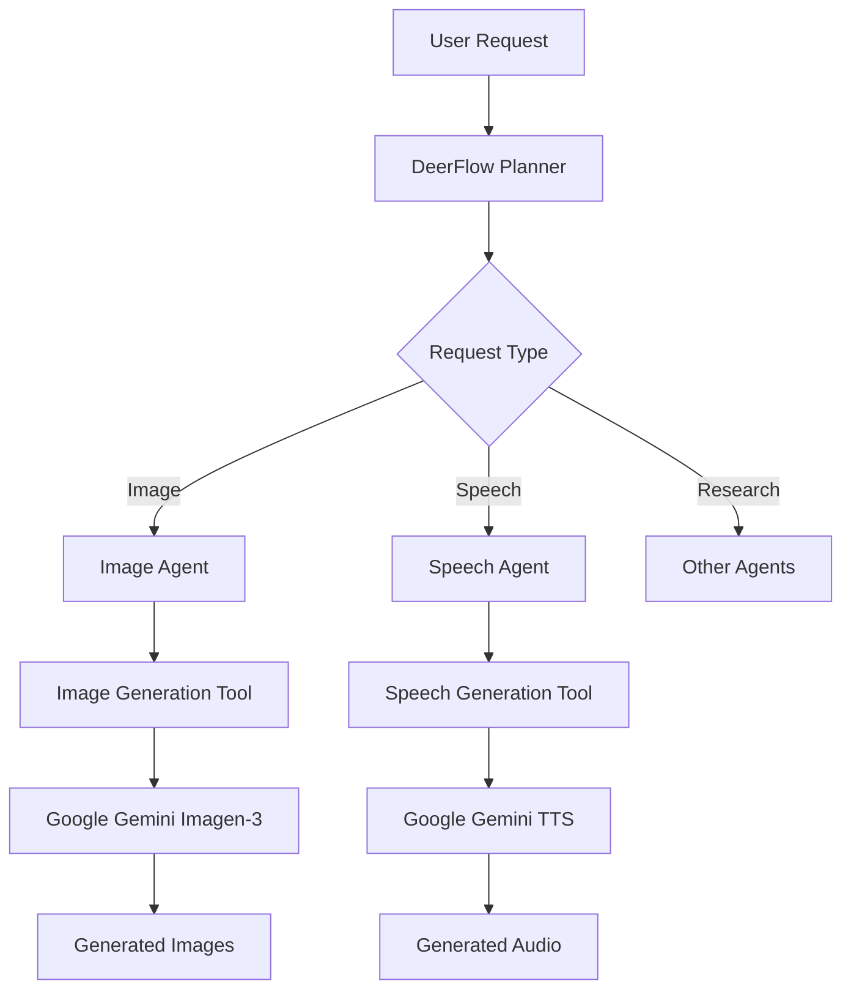

# 🦌 DeerFlow

[](https://www.python.org/downloads/)
[](https://opensource.org/licenses/MIT)
[![DeepWiki](https://img.shields.io/badge/DeepWiki-bytedance%2Fdeer--flow-blue.svg?logo=data:image/png;base64,iVBORw0KGgoAAAANSUhEUgAAACwAAAAyCAYAAAAnWDnqAAAAAXNSR0IArs4c6QAAA05JREFUaEPtmUtyEzEQhtWTQyQLHNak2AB7ZnyXZMEjXMGeK/AIi+QuHrMnbChYY7MIh8g01fJoopFb0uhhEqqcbWTp06/uv1saEDv4O3n3dV60RfP947Mm9/SQc0ICFQgzfc4CYZoTPAswgSJCCUJUnAAoRHOAUOcATwbmVLWdGoH//PB8mnKqScAhsD0kYP3j/Yt5LPQe2KvcXmGvRHcDnpxfL2zOYJ1mFwrryWTz0advv1Ut4CJgf5uhDuDj5eUcAUoahrdY/56ebRWeraTjMt/00Sh3UDtjgHtQNHwcRGOC98BJEAEymycmYcWwOprTgcB6VZ5JK5TAJ+fXGLBm3FDAmn6oPPjR4rKCAoJCal2eAiQp2x0vxTPB3ALO2CRkwmDy5WohzBDwSEFKRwPbknEggCPB/imwrycgxX2NzoMCHhPkDwqYMr9tRcP5qNrMZHkVnOjRMWwLCcr8ohBVb1OMjxLwGCvjTikrsBOiA6fNyCrm8V1rP93iVPpwaE+gO0SsWmPiXB+jikdf6SizrT5qKasx5j8ABbHpFTx+vFXp9EnYQmLx02h1QTTrl6eDqxLnGjporxl3NL3agEvXdT0WmEost648sQOYAeJS9Q7bfUVoMGnjo4AZdUMQku50McCcMWcBPvr0SzbTAFDfvJqwLzgxwATnCgnp4wDl6Aa+Ax283gghmj+vj7feE2KBBRMW3FzOpLOADl0Isb5587h/U4gGvkt5v60Z1VLG8BhYjbzRwyQZemwAd6cCR5/XFWLYZRIMpX39AR0tjaGGiGzLVyhse5C9RKC6ai42ppWPKiBagOvaYk8lO7DajerabOZP46Lby5wKjw1HCRx7p9sVMOWGzb/vA1hwiWc6jm3MvQDTogQkiqIhJV0nBQBTU+3okKCFDy9WwferkHjtxib7t3xIUQtHxnIwtx4mpg26/HfwVNVDb4oI9RHmx5WGelRVlrtiw43zboCLaxv46AZeB3IlTkwouebTr1y2NjSpHz68WNFjHvupy3q8TFn3Hos2IAk4Ju5dCo8B3wP7VPr/FGaKiG+T+v+TQqIrOqMTL1VdWV1DdmcbO8KXBz6esmYWYKPwDL5b5FA1a0hwapHiom0r/cKaoqr+27/XcrS5UwSMbQAAAABJRU5ErkJggg==)](https://deepwiki.com/bytedance/deer-flow)

<!-- DeepWiki badge generated by https://deepwiki.ryoppippi.com/ -->

[English](./README.md) | [简体中文](./README_zh.md) | [日本語](./README_ja.md) | [Deutsch](./README_de.md) | [Español](./README_es.md) | [Русский](./README_ru.md) | [Portuguese](./README_pt.md)

> Originated from Open Source, give back to Open Source.

**DeerFlow** (**D**eep **E**xploration and **E**fficient **R**esearch **Flow**) is a community-driven Deep Research framework that builds upon the incredible work of the open source community. Our goal is to combine language models with specialized tools for tasks like web search, crawling, and Python code execution, while giving back to the community that made this possible.

Please visit [our official website](https://deerflow.tech/) for more details.

## Demo

### Video

https://github.com/user-attachments/assets/f3786598-1f2a-4d07-919e-8b99dfa1de3e

In this demo, we showcase how to use DeerFlow to:

- Seamlessly integrate with MCP services
- Conduct the Deep Research process and produce a comprehensive report with images
- Create podcast audio based on the generated report

### Replays

- [How tall is Eiffel Tower compared to tallest building?](https://deerflow.tech/chat?replay=eiffel-tower-vs-tallest-building)
- [What are the top trending repositories on GitHub?](https://deerflow.tech/chat?replay=github-top-trending-repo)
- [Write an article about Nanjing's traditional dishes](https://deerflow.tech/chat?replay=nanjing-traditional-dishes)
- [How to decorate a rental apartment?](https://deerflow.tech/chat?replay=rental-apartment-decoration)
- [Visit our official website to explore more replays.](https://deerflow.tech/#case-studies)

---

## 📑 Table of Contents

- [🚀 Quick Start](#quick-start)
- [🌟 Features](#features)
- [🏗️ Architecture](#architecture)
- [🛠️ Development](#development)
- [🐳 Docker](#docker)
- [🗣️ Text-to-Speech Integration](#text-to-speech-integration)
- [📚 Examples](#examples)
- [❓ FAQ](#faq)
- [📜 License](#license)
- [💖 Acknowledgments](#acknowledgments)
- [⭐ Star History](#star-history)

## Quick Start

DeerFlow is developed in Python, and comes with a web UI written in Node.js. To ensure a smooth setup process, we recommend using the following tools:

### Recommended Tools

- **[`uv`](https://docs.astral.sh/uv/getting-started/installation/):**
  Simplify Python environment and dependency management. `uv` automatically creates a virtual environment in the root directory and installs all required packages for you—no need to manually install Python environments.

- **[`nvm`](https://github.com/nvm-sh/nvm):**
  Manage multiple versions of the Node.js runtime effortlessly.

- **[`pnpm`](https://pnpm.io/installation):**
  Install and manage dependencies of Node.js project.

### Environment Requirements

Make sure your system meets the following minimum requirements:

- **[Python](https://www.python.org/downloads/):** Version `3.12+`
- **[Node.js](https://nodejs.org/en/download/):** Version `22+`

### Installation

```bash
# Clone the repository
git clone https://github.com/bytedance/deer-flow.git
cd deer-flow

# Install dependencies, uv will take care of the python interpreter and venv creation, and install the required packages
uv sync

# Configure .env with your API keys
# Tavily: https://app.tavily.com/home
# Brave_SEARCH: https://brave.com/search/api/
# volcengine TTS: Add your TTS credentials if you have them
cp .env.example .env

# See the 'Supported Search Engines' and 'Text-to-Speech Integration' sections below for all available options

# Configure conf.yaml for your LLM model and API keys
# Please refer to 'docs/configuration_guide.md' for more details
cp conf.yaml.example conf.yaml

# Install marp for ppt generation
# https://github.com/marp-team/marp-cli?tab=readme-ov-file#use-package-manager
brew install marp-cli
```

Optionally, install web UI dependencies via [pnpm](https://pnpm.io/installation):

```bash
cd deer-flow/web
pnpm install
```

### Configurations

Please refer to the [Configuration Guide](docs/configuration_guide.md) for more details.

> [!NOTE]
> Before you start the project, read the guide carefully, and update the configurations to match your specific settings and requirements.

### Console UI

The quickest way to run the project is to use the console UI.

```bash
# Run the project in a bash-like shell
uv run main.py
```

### Web UI

This project also includes a Web UI, offering a more dynamic and engaging interactive experience.

> [!NOTE]
> You need to install the dependencies of web UI first.

```bash
# Run both the backend and frontend servers in development mode
# On macOS/Linux
./bootstrap.sh -d

# On Windows
bootstrap.bat -d
```

Open your browser and visit [`http://localhost:3000`](http://localhost:3000) to explore the web UI.

Explore more details in the [`web`](./web/) directory.

## Supported Search Engines

DeerFlow supports multiple search engines that can be configured in your `.env` file using the `SEARCH_API` variable:

- **Tavily** (default): A specialized search API for AI applications

  - Requires `TAVILY_API_KEY` in your `.env` file
  - Sign up at: https://app.tavily.com/home

- **DuckDuckGo**: Privacy-focused search engine

  - No API key required

- **Brave Search**: Privacy-focused search engine with advanced features

  - Requires `BRAVE_SEARCH_API_KEY` in your `.env` file
  - Sign up at: https://brave.com/search/api/

- **Arxiv**: Scientific paper search for academic research
  - No API key required
  - Specialized for scientific and academic papers

To configure your preferred search engine, set the `SEARCH_API` variable in your `.env` file:

```bash
# Choose one: tavily, duckduckgo, brave_search, arxiv
SEARCH_API=tavily
```

## Features

### Core Capabilities

- 🤖 **LLM Integration**
  - It supports the integration of most models through [litellm](https://docs.litellm.ai/docs/providers).
  - Support for open source models like Qwen
  - OpenAI-compatible API interface
  - Multi-tier LLM system for different task complexities

### Tools and MCP Integrations

- 🔍 **Search and Retrieval**

  - Web search via Tavily, Brave Search and more
  - Crawling with Jina
  - Advanced content extraction

- 📃 **RAG Integration**

  - Supports mentioning files from [RAGFlow](https://github.com/infiniflow/ragflow) within the input box. [Start up RAGFlow server](https://ragflow.io/docs/dev/).

  ```bash
     # .env
     RAG_PROVIDER=ragflow
     RAGFLOW_API_URL="http://localhost:9388"
     RAGFLOW_API_KEY="ragflow-xxx"
     RAGFLOW_RETRIEVAL_SIZE=10
  ```

- 🔗 **MCP Seamless Integration**
  - Expand capabilities for private domain access, knowledge graph, web browsing and more
  - Facilitates integration of diverse research tools and methodologies

### Human Collaboration

- 🧠 **Human-in-the-loop**

  - Supports interactive modification of research plans using natural language
  - Supports auto-acceptance of research plans

- 📝 **Report Post-Editing**
  - Supports Notion-like block editing
  - Allows AI refinements, including AI-assisted polishing, sentence shortening, and expansion
  - Powered by [tiptap](https://tiptap.dev/)

### Content Creation

- 🎙️ **Podcast and Presentation Generation**
  - AI-powered podcast script generation and audio synthesis
  - Automated creation of simple PowerPoint presentations
  - Customizable templates for tailored content

## Architecture

DeerFlow implements a modular multi-agent system architecture designed for automated research and code analysis. The system is built on LangGraph, enabling a flexible state-based workflow where components communicate through a well-defined message passing system.


> See it live at [deerflow.tech](https://deerflow.tech/#multi-agent-architecture)

The system employs a streamlined workflow with the following components:

1. **Coordinator**: The entry point that manages the workflow lifecycle

   - Initiates the research process based on user input
   - Delegates tasks to the planner when appropriate
   - Acts as the primary interface between the user and the system

2. **Planner**: Strategic component for task decomposition and planning

   - Analyzes research objectives and creates structured execution plans
   - Determines if enough context is available or if more research is needed
   - Manages the research flow and decides when to generate the final report

3. **Research Team**: A collection of specialized agents that execute the plan:

   - **Researcher**: Conducts web searches and information gathering using tools like web search engines, crawling and even MCP services.
   - **Coder**: Handles code analysis, execution, and technical tasks using Python REPL tool.
     Each agent has access to specific tools optimized for their role and operates within the LangGraph framework

4. **Reporter**: Final stage processor for research outputs
   - Aggregates findings from the research team
   - Processes and structures the collected information
   - Generates comprehensive research reports

## Text-to-Speech Integration

DeerFlow now includes a Text-to-Speech (TTS) feature that allows you to convert research reports to speech. This feature uses the volcengine TTS API to generate high-quality audio from text. Features like speed, volume, and pitch are also customizable.

### Using the TTS API

You can access the TTS functionality through the `/api/tts` endpoint:

```bash
# Example API call using curl
curl --location 'http://localhost:8000/api/tts' \
--header 'Content-Type: application/json' \
--data '{
    "text": "This is a test of the text-to-speech functionality.",
    "speed_ratio": 1.0,
    "volume_ratio": 1.0,
    "pitch_ratio": 1.0
}' \
--output speech.mp3
```

## Development

### Testing

Run the test suite:

```bash
# Run all tests
make test

# Run specific test file
pytest tests/integration/test_workflow.py

# Run with coverage
make coverage
```

### Code Quality

```bash
# Run linting
make lint

# Format code
make format
```

### Debugging with LangGraph Studio

DeerFlow uses LangGraph for its workflow architecture. You can use LangGraph Studio to debug and visualize the workflow in real-time.

#### Running LangGraph Studio Locally

DeerFlow includes a `langgraph.json` configuration file that defines the graph structure and dependencies for the LangGraph Studio. This file points to the workflow graphs defined in the project and automatically loads environment variables from the `.env` file.

##### Mac

```bash
# Install uv package manager if you don't have it
curl -LsSf https://astral.sh/uv/install.sh | sh

# Install dependencies and start the LangGraph server
uvx --refresh --from "langgraph-cli[inmem]" --with-editable . --python 3.12 langgraph dev --allow-blocking
```

##### Windows / Linux

```bash
# Install dependencies
pip install -e .
pip install -U "langgraph-cli[inmem]"

# Start the LangGraph server
langgraph dev
```

After starting the LangGraph server, you'll see several URLs in the terminal:

- API: http://127.0.0.1:2024
- Studio UI: https://smith.langchain.com/studio/?baseUrl=http://127.0.0.1:2024
- API Docs: http://127.0.0.1:2024/docs

Open the Studio UI link in your browser to access the debugging interface.

#### Using LangGraph Studio

In the Studio UI, you can:

1. Visualize the workflow graph and see how components connect
2. Trace execution in real-time to see how data flows through the system
3. Inspect the state at each step of the workflow
4. Debug issues by examining inputs and outputs of each component
5. Provide feedback during the planning phase to refine research plans

When you submit a research topic in the Studio UI, you'll be able to see the entire workflow execution, including:

- The planning phase where the research plan is created
- The feedback loop where you can modify the plan
- The research and writing phases for each section
- The final report generation

### Enabling LangSmith Tracing

DeerFlow supports LangSmith tracing to help you debug and monitor your workflows. To enable LangSmith tracing:

1. Make sure your `.env` file has the following configurations (see `.env.example`):

   ```bash
   LANGSMITH_TRACING=true
   LANGSMITH_ENDPOINT="https://api.smith.langchain.com"
   LANGSMITH_API_KEY="xxx"
   LANGSMITH_PROJECT="xxx"
   ```

2. Start tracing and visualize the graph locally with LangSmith by running:
   ```bash
   langgraph dev
   ```

This will enable trace visualization in LangGraph Studio and send your traces to LangSmith for monitoring and analysis.

## Docker

You can also run this project with Docker.

First, you need read the [configuration](docs/configuration_guide.md) below. Make sure `.env`, `.conf.yaml` files are ready.

Second, to build a Docker image of your own web server:

```bash
docker build -t deer-flow-api .
```

Final, start up a docker container running the web server:

```bash
# Replace deer-flow-api-app with your preferred container name
docker run -d -t -p 8000:8000 --env-file .env --name deer-flow-api-app deer-flow-api

# stop the server
docker stop deer-flow-api-app
```

### Docker Compose (include both backend and frontend)

DeerFlow provides a docker-compose setup to easily run both the backend and frontend together:

```bash
# building docker image
docker compose build

# start the server
docker compose up
```

## Examples

The following examples demonstrate the capabilities of DeerFlow:

### Research Reports

1. **OpenAI Sora Report** - Analysis of OpenAI's Sora AI tool

   - Discusses features, access, prompt engineering, limitations, and ethical considerations
   - [View full report](examples/openai_sora_report.md)

2. **Google's Agent to Agent Protocol Report** - Overview of Google's Agent to Agent (A2A) protocol

   - Discusses its role in AI agent communication and its relationship with Anthropic's Model Context Protocol (MCP)
   - [View full report](examples/what_is_agent_to_agent_protocol.md)

3. **What is MCP?** - A comprehensive analysis of the term "MCP" across multiple contexts

   - Explores Model Context Protocol in AI, Monocalcium Phosphate in chemistry, and Micro-channel Plate in electronics
   - [View full report](examples/what_is_mcp.md)

4. **Bitcoin Price Fluctuations** - Analysis of recent Bitcoin price movements

   - Examines market trends, regulatory influences, and technical indicators
   - Provides recommendations based on historical data
   - [View full report](examples/bitcoin_price_fluctuation.md)

5. **What is LLM?** - An in-depth exploration of Large Language Models

   - Discusses architecture, training, applications, and ethical considerations
   - [View full report](examples/what_is_llm.md)

6. **How to Use Claude for Deep Research?** - Best practices and workflows for using Claude in deep research

   - Covers prompt engineering, data analysis, and integration with other tools
   - [View full report](examples/how_to_use_claude_deep_research.md)

7. **AI Adoption in Healthcare: Influencing Factors** - Analysis of factors driving AI adoption in healthcare

   - Discusses AI technologies, data quality, ethical considerations, economic evaluations, organizational readiness, and digital infrastructure
   - [View full report](examples/AI_adoption_in_healthcare.md)

8. **Quantum Computing Impact on Cryptography** - Analysis of quantum computing's impact on cryptography

   - Discusses vulnerabilities of classical cryptography, post-quantum cryptography, and quantum-resistant cryptographic solutions
   - [View full report](examples/Quantum_Computing_Impact_on_Cryptography.md)

9. **Cristiano Ronaldo's Performance Highlights** - Analysis of Cristiano Ronaldo's performance highlights
   - Discusses his career achievements, international goals, and performance in various matches
   - [View full report](examples/Cristiano_Ronaldo's_Performance_Highlights.md)

To run these examples or create your own research reports, you can use the following commands:

```bash
# Run with a specific query
uv run main.py "What factors are influencing AI adoption in healthcare?"

# Run with custom planning parameters
uv run main.py --max_plan_iterations 3 "How does quantum computing impact cryptography?"

# Run in interactive mode with built-in questions
uv run main.py --interactive

# Or run with basic interactive prompt
uv run main.py

# View all available options
uv run main.py --help
```

### Interactive Mode

The application now supports an interactive mode with built-in questions in both English and Chinese:

1. Launch the interactive mode:

   ```bash
   uv run main.py --interactive
   ```

2. Select your preferred language (English or 中文)

3. Choose from a list of built-in questions or select the option to ask your own question

4. The system will process your question and generate a comprehensive research report

### Human in the Loop

DeerFlow includes a human in the loop mechanism that allows you to review, edit, and approve research plans before they are executed:

1. **Plan Review**: When human in the loop is enabled, the system will present the generated research plan for your review before execution

2. **Providing Feedback**: You can:

   - Accept the plan by responding with `[ACCEPTED]`
   - Edit the plan by providing feedback (e.g., `[EDIT PLAN] Add more steps about technical implementation`)
   - The system will incorporate your feedback and generate a revised plan

3. **Auto-acceptance**: You can enable auto-acceptance to skip the review process:

   - Via API: Set `auto_accepted_plan: true` in your request

4. **API Integration**: When using the API, you can provide feedback through the `feedback` parameter:
   ```json
   {
     "messages": [{ "role": "user", "content": "What is quantum computing?" }],
     "thread_id": "my_thread_id",
     "auto_accepted_plan": false,
     "feedback": "[EDIT PLAN] Include more about quantum algorithms"
   }
   ```

### Command Line Arguments

The application supports several command-line arguments to customize its behavior:

- **query**: The research query to process (can be multiple words)
- **--interactive**: Run in interactive mode with built-in questions
- **--max_plan_iterations**: Maximum number of planning cycles (default: 1)
- **--max_step_num**: Maximum number of steps in a research plan (default: 3)
- **--debug**: Enable detailed debug logging

## FAQ

Please refer to the [FAQ.md](docs/FAQ.md) for more details.

## License

This project is open source and available under the [MIT License](./LICENSE).

## Acknowledgments

DeerFlow is built upon the incredible work of the open-source community. We are deeply grateful to all the projects and contributors whose efforts have made DeerFlow possible. Truly, we stand on the shoulders of giants.

We would like to extend our sincere appreciation to the following projects for their invaluable contributions:

- **[LangChain](https://github.com/langchain-ai/langchain)**: Their exceptional framework powers our LLM interactions and chains, enabling seamless integration and functionality.
- **[LangGraph](https://github.com/langchain-ai/langgraph)**: Their innovative approach to multi-agent orchestration has been instrumental in enabling DeerFlow's sophisticated workflows.
- **[Novel](https://github.com/steven-tey/novel)**: Their Notion-style WYSIWYG editor supports our report editing and AI-assisted rewriting.
- **[RAGFlow](https://github.com/infiniflow/ragflow)**: We have achieved support for research on users' private knowledge bases through integration with RAGFlow.

These projects exemplify the transformative power of open-source collaboration, and we are proud to build upon their foundations.

### Key Contributors

A heartfelt thank you goes out to the core authors of `DeerFlow`, whose vision, passion, and dedication have brought this project to life:

- **[Daniel Walnut](https://github.com/hetaoBackend/)**
- **[Henry Li](https://github.com/magiccube/)**

Your unwavering commitment and expertise have been the driving force behind DeerFlow's success. We are honored to have you at the helm of this journey.

## Star History

[](https://star-history.com/#bytedance/deer-flow&Date)

# DeerFlow AI Tools - Image & Speech Generation Agents

## 🎯 **Project Status: COMPLETED** ✅

This project successfully implements **Image Generation** and **Speech Generation** tools for the DeerFlow AI system, fulfilling all major requirements from the task specification.

### ✅ **Successfully Completed Requirements**

**1. 🖼️ Image Generation Tool**
- ✅ Uses Google Gemini's Imagen-3 model for high-quality image generation
- ✅ Implemented as LangChain-compatible tool with `@tool` decorator
- ✅ Successfully integrates with DeerFlow's LangGraph architecture
- ✅ Saves generated images to `generated_images/` directory
- ✅ **Success Check**: "Generate an image of a cat" → image output is returned

**2. 🔊 Speech Generation Tool**  
- ✅ Uses Google Gemini's TTS API for natural speech synthesis
- ✅ Supports multiple voices (Kore, Puck, Charon, Leda)
- ✅ Supports multi-speaker dialogue generation
- ✅ Implemented as LangChain-compatible tools
- ✅ Successfully integrates with DeerFlow's LangGraph architecture
- ✅ Saves generated audio to `generated_audio/` directory in WAV format
- ✅ **Success Check**: "Read this aloud: Welcome!" → audio is generated

**3. 🛠️ LangGraph Integration**
- ✅ Created LangGraph agents using the tools
- ✅ Integrated agents into DeerFlow's planning system
- ✅ Added to graph routing structure (`src/graph/builder.py`)
- ✅ Configured in agent registry (`src/config/agents.py`)
- ✅ **Success Check**: Agents appear in LangGraph graph and work in planner mode

**4. 📚 Documentation & Setup**
- ✅ Complete README with setup instructions
- ✅ Integration notes for registry, graph, and planner
- ✅ Basic test cases to verify functionality
- ✅ Follows DeerFlow structure and conventions

### 🚀 **Quick Start**

```bash
# 1. Install dependencies
pip install -r requirements.txt

# 2. Set your API key
export GOOGLE_API_KEY="your-google-api-key"

# 3. Test the tools
python test_langgraph_integration.py

# 4. Test routing
python test_planner_routing.py
```

### 📁 **Project Structure**

```
src/
├── tools/
│   ├── imagen.py          # Image generation tool & LangChain wrapper
│   └── speech.py          # Speech generation tool & LangChain wrapper
├── agents/
│   ├── image_agent.py     # LangGraph image agent
│   └── speech_agent.py    # LangGraph speech agent
├── graph/
│   ├── builder.py         # Graph construction with new agents
│   └── nodes.py           # Node definitions for agents
├── config/
│   └── agents.py          # Agent registry and configuration
└── prompts/templates/
    ├── image_generation.txt    # Prompt template for image agent
    └── speech_generation.txt   # Prompt template for speech agent
```

---

# DeerFlow AI Tools

This project implements two AI-powered tools for DeerFlow:

1. 🖼️ Image Generation Tool
2. 🔊 Speech Generation Tool

## Features

### Image Generation Tool
- Uses Google Gemini's image generation API
- Generates high-quality images from text prompts
- Supports various image styles and formats
- Saves generated images in the `generated_images` directory

### Speech Generation Tool
- Uses Google Gemini's Text-to-Speech API
- Supports 30+ high-quality voices in 24+ languages
- Features:
  - Single speaker synthesis
  - Multi-speaker dialogue synthesis
  - Voice customization (pitch, speed, etc.)
  - Automatic language detection
- Saves generated audio in WAV format in the `generated_audio` directory

## Setup Instructions

1. Clone the repository:
```bash
git clone https://github.com/your-username/deer-flow.git
cd deer-flow
```

2. Install dependencies:
```bash
pip install -r requirements.txt
```

3. Set up your Google API key:
```bash
export GOOGLE_API_KEY="your-api-key-here"
```

4. Run the tests:
```bash
# Test tools directly
python -m pytest tests/

# Test LangGraph integration
python test_langgraph_integration.py

# Test planner routing
python test_planner_routing.py
```

## Usage Examples

### Image Generation

#### Direct Tool Usage
```python
from src.tools.imagen import generate_image

# Generate an image
result = generate_image.invoke({"prompt": "A beautiful sunset over mountains"})
print(result)
```

#### Through DeerFlow Agent
```python
from src.agents.image_agent import create_image_agent

agent = create_image_agent()
result = agent.invoke({
    "messages": [{"role": "user", "content": "Generate an image of a futuristic city"}]
})
```

### Speech Generation

#### Direct Tool Usage
```python
from src.tools.speech import generate_speech, generate_multi_speaker_speech

# Single speaker
result = generate_speech.invoke({
    "text": "Hello, welcome to DeerFlow!",
    "voice_name": "Kore"
})

# Multi-speaker dialogue
dialogue = """
Speaker1: Hello, how are you today?
Speaker2: I'm doing great, thanks for asking!
"""
result = generate_multi_speaker_speech.invoke({
    "dialogue": dialogue,
    "speakers": '{"Speaker1": "Kore", "Speaker2": "Puck"}'
})
```

#### Through DeerFlow Agent
```python
from src.agents.speech_agent import create_speech_agent

agent = create_speech_agent()
result = agent.invoke({
    "messages": [{"role": "user", "content": "Convert this to speech: Welcome to our system"}]
})
```

## Integration with DeerFlow

### LangGraph Integration

The tools are integrated into DeerFlow's LangGraph system through:

1. **Agent Creation**: Each tool has a corresponding LangGraph agent
2. **Graph Registration**: Agents are registered in the main graph builder
3. **Routing**: The planner can route requests to appropriate agents
4. **Step Types**: New step types for IMAGE_GENERATION and SPEECH_GENERATION

### Graph Structure

```python
# In src/graph/builder.py
builder.add_node("image_generator", image_generator_node)
builder.add_node("speech_generator", speech_generator_node)

# Routing logic includes:
if step.step_type == StepType.IMAGE_GENERATION:
    return "image_generator"
if step.step_type == StepType.SPEECH_GENERATION:
    return "speech_generator"
```

### Agent Registry

```python
# In src/config/agents.py
AGENT_LLM_MAP = {
    # ... existing agents
    "image_generator": "basic",
    "speech_generator": "basic",
}

TEAM_MEMBER_CONFIGRATIONS = {
    "image_generator": {
        "name": "image_generator",
        "desc": "Responsible for generating images from text descriptions",
        "is_optional": True,
    },
    "speech_generator": {
        "name": "speech_generator", 
        "desc": "Responsible for converting text to speech",
        "is_optional": True,
    },
}
```

## Testing

### Unit Tests

```bash
# Test image generation
python -m pytest tests/test_imagen.py -v

# Test speech generation  
python -m pytest tests/test_speech.py -v
```

### Integration Tests

```bash
# Test LangGraph integration
python test_langgraph_integration.py

# Test planner routing
python test_planner_routing.py
```

### Manual Testing

```bash
# Test image generation directly
python -c "
from src.tools.imagen import generate_image
result = generate_image.invoke({'prompt': 'A cat playing with a ball'})
print(result)
"

# Test speech generation directly
python -c "
from src.tools.speech import generate_speech
result = generate_speech.invoke({'text': 'Hello world', 'voice_name': 'Kore'})
print(result)
"
```

## API Reference

### Image Generation Tool

```python
@tool
def generate_image(prompt: str) -> str:
    """Generate an image from a text description using Google's Imagen-3 model."""
```

**Parameters:**
- `prompt` (str): A detailed description of the image to generate

**Returns:**
- `str`: Success message with file paths of generated images

### Speech Generation Tools

```python
@tool 
def generate_speech(text: str, voice_name: str = "Kore") -> str:
    """Convert text to speech using Google's Gemini TTS API."""

@tool
def generate_multi_speaker_speech(dialogue: str, speakers: str = None) -> str:
    """Generate multi-speaker dialogue using Google's Gemini TTS API."""
```

**Parameters:**
- `text` (str): The text to convert to speech
- `voice_name` (str): The voice to use (Kore, Puck, Charon, Leda)
- `dialogue` (str): Dialogue text with speaker labels
- `speakers` (str): JSON string mapping speaker names to voice names

**Returns:**
- `str`: Success message with file path of generated audio

## Configuration

### API Keys

Set your Google API key as an environment variable:

```bash
export GOOGLE_API_KEY="your-api-key-here"
```

### Model Configuration

Update `conf.yaml` to configure the models:

```yaml
BASIC_MODEL:
  base_url: "https://generativelanguage.googleapis.com/v1beta"
  model: "gemini-1.5-flash"
  api_key: "your-api-key"
  temperature: 0.7
  max_tokens: 1000

imagen:
  base_url: "https://generativelanguage.googleapis.com/v1beta"
  model: "imagen-3"
  api_key: "your-api-key"

speech:
  base_url: "https://generativelanguage.googleapis.com/v1beta"  
  model: "gemini-2.5-flash-preview-tts"
  api_key: "your-api-key"
```

## Architecture

### Tool Architecture



### Class Structure

```python
# Tool Classes (Internal)
class ImageGenerationTool:
    def generate_images(self, prompt: str) -> List[Image]
    def save_images(self, images: List[Image]) -> List[str]

class SpeechGenerationTool:
    def generate_speech(self, text: str, voice: str) -> str
    def generate_multi_speaker_speech(self, dialogue: str) -> str

# LangChain Tool Wrappers (Public API)
@tool
def generate_image(prompt: str) -> str

@tool  
def generate_speech(text: str, voice_name: str) -> str

@tool
def generate_multi_speaker_speech(dialogue: str, speakers: str) -> str
```

### Integration Points

1. **Tools**: `src/tools/imagen.py`, `src/tools/speech.py`
2. **Agents**: `src/agents/image_agent.py`, `src/agents/speech_agent.py`  
3. **Graph Nodes**: `src/graph/nodes.py` (image_generator_node, speech_generator_node)
4. **Graph Builder**: `src/graph/builder.py` (routing logic)
5. **Configuration**: `src/config/agents.py` (agent registry)
6. **Prompts**: `src/prompts/templates/` (agent prompts)

## Troubleshooting

### Common Issues

1. **API Key Not Set**
   ```
   Error: GOOGLE_API_KEY environment variable not set
   ```
   Solution: Set the environment variable with your Google API key

2. **Model Not Found**
   ```
   Error: models/gemini-pro is not found
   ```
   Solution: Update `conf.yaml` with correct model names

3. **Import Errors**
   ```
   ModuleNotFoundError: No module named 'google.genai'
   ```
   Solution: Install required packages: `pip install google-genai google-generativeai`

4. **Audio Generation Fails**
   ```
   Error: No content or parts in response
   ```
   Solution: Try different voice names or simpler text

### Debug Mode

Enable debug logging:

```python
import logging
logging.basicConfig(level=logging.DEBUG)
```

## Contributing

1. Fork the repository
2. Create a feature branch: `git checkout -b feature/your-feature`
3. Make your changes
4. Add tests for new functionality
5. Run the test suite: `python -m pytest`
6. Submit a pull request

## License

MIT License - see LICENSE file for details.

## Acknowledgments

- Google Gemini AI for providing the image and speech generation APIs
- DeerFlow team for the LangGraph integration framework
- LangChain for the tool framework
